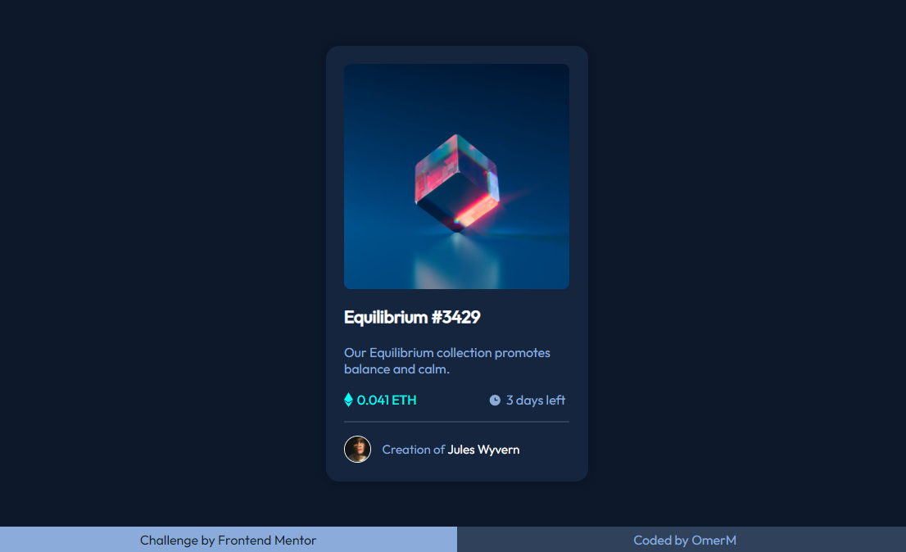
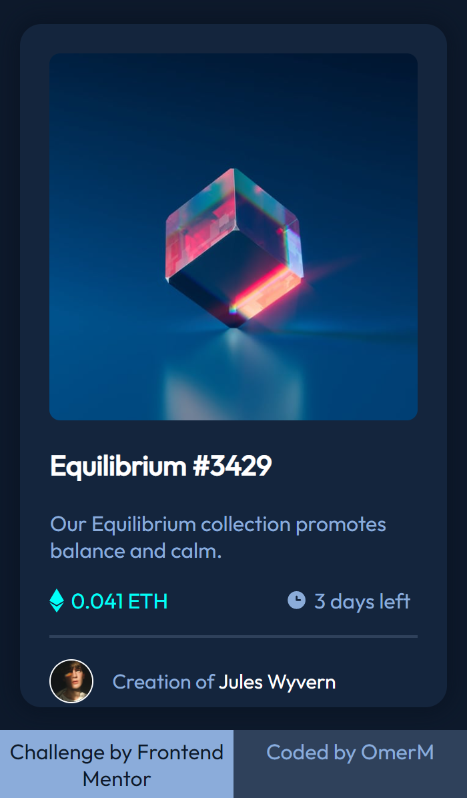

# Frontend Mentor - NFT preview card component

<h5 align="center">Assalam U Alaikum, I have nothing to write -_-</h5>
<hr>

## The challenge

Users should be able to:

- View the optimal layout depending on their device's screen size
- See hover and focus states for interactive elements

## Snapshots




## What I learned?

My speed is going up. Okay, so seriously image overlay hover type effect whatever it's called I learned that :/

```css
 .Hero_Img {
    width: 100%;
    position: relative;
}
```

## Useful resources

[Image hover overlay](https://www.w3schools.com/howto/howto_css_image_overlay_icon.asp) - I feel like I cheated but dude we're programmers B)

[position: relative;](https://www.tutorialspoint.com/how-to-create-image-overlay-icon-effect-on-hover-with-css) - Yeah that's how much I learned: I needed to add relative in my code

## Thoughts

I completed it in like 5 hours? as from previous project I got quite the hang of it. I don't know what I'm saying but yeah it caught my eye cuz of it's dark themed colors. Right now I'm kinda stuck at image hover thingy as it's a little taller than the image.

## Author

- Twitter - [@MaskeyDude](https://www.twitter.com/MaskeyDude)
- Frontend Mentor - [@MaskeyDude](https://www.frontendmentor.io/profile/MaskeyDude)

<hr>
Yallah, Assalam U Alaikum
